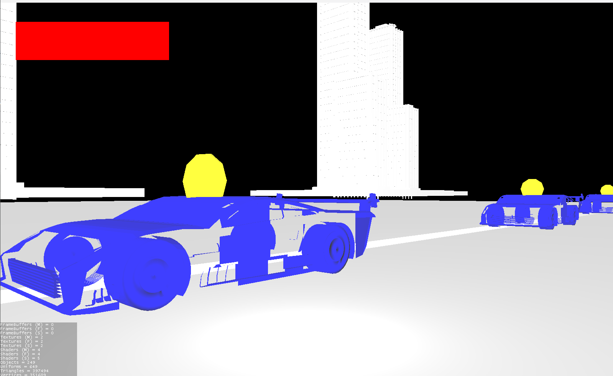
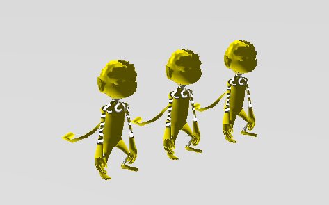
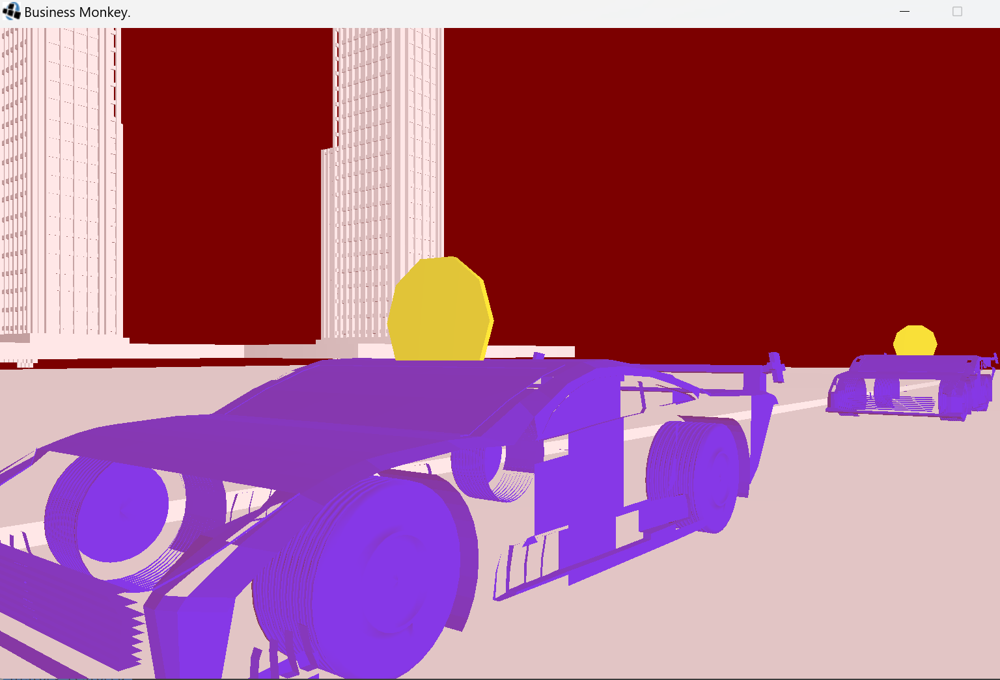

# BusinessMonkey

## Game Design Document

### Game Summary

**Abu's had enough.** He never wanted to go apeshit. But when his business associate ran away with his coins, he knew it was time for some payback. With fury in his eyes and a gun in his hand, Abu has only one mission: getting his coins back, and shooting his way through any rival triad group necessary.

In this high-octane first-person shooter, you’ll race through the city, blasting enemies left and right, and reclaiming your lost loot. Jump, flip, and swing like the manic monkey you are as you parkour through buildings and foggy alleyways. The rival triad group won’t know what hit 'em!

Every level brings unique enemies and challenges, but Abu's got the moves — and plenty of ammo — to make it through. Can you navigate the chaos, dodge firestorms, and blast your way to the top to get your coins back? The streets of Hong Kong are calling. Time to go bananas!

### Genre

Get ready for the ultimate monkey mayhem! Abu’s out for vengeance in this fast-paced first-person shooter, where arcade thrills meet explosive action. Each level is a battleground packed with enemies and a chance to prove you’ve got the moves—and the shots—to come out on top. As you blast through waves of foes, you'll even eventually encounter power-ups will give you a temporary edge, like super speed, increased damage, or even an invincible monkey mode to wreak havoc.

The levels are quick but intense, designed to let you explore hidden nooks between battles while still keeping the action non-stop. With parading waves of enemies, each more dangerous than the last, you'll need to use every ounce of your parkour skills to stay one step ahead. Jump, climb, swing, and dash through the city as you outsmart your rivals and collect your precious coins.

And don’t forget about the scoring system (unfortunately not implemented in final product) — the faster you clear levels and more monkie-osos you eliminate, the higher your score. Nail impossible shots and clear tough waves without taking a hit for bragging rights. Challenge yourself with every run to go faster, play smarter, and rack up those points. Each attempt is a chance to experiment with new strategies, finding the most efficient ways to dominate the streets.

### Inspiration

Our primary sources of inspiration were Doom and Superhot. The fast-paced first-person shooting of Doom is the perfect mood for this maniacal shooter. Additionally, its arcadey aspects with item pickups and short, linear, wave-based levels. Superhot has a nice low-poly art style which is a solid art style that is relatively quick to prototype games with.

Additionally, we like the parkour/movement of Neon White, Titanfall 2, and Mirror's Edge. We are especially excited to add the wall running, double jumping, and environmental boosts (i.e. bounce pads) to our game if we have time.

<https://en.wikipedia.org/wiki/Doom_Eternal>

<https://en.wikipedia.org/wiki/Superhot>

<https://en.wikipedia.org/wiki/Neon_White>

<https://en.wikipedia.org/wiki/Titanfall_2>

<https://en.wikipedia.org/wiki/Mirror%27s_Edge>

### Gameplay

The game is played from a first-person perspective, with fast-paced, fluid movement that lets players run, jump, and shoot with precision. The maps are designed to facilitate quick, agile movements, encouraging players to leap between platforms and buildings while avoiding enemies in the bustling streets of Hong Kong. In the early stages of each level, most enemies are easy to take down, but the real challenge comes from their numbers. As players progress, they’ll face tougher enemies and larger waves, requiring strategic thinking to clear new levels. The HUD is minimalist, displaying only the essentials - how much longer you can go. Controls are simple and intuitive, using WASD for movement and the mouse for aiming and shooting.

Some ideas we would like to implement if we have time are...

- Multi-layered levels. i.e. in the streets of Hong Kong, you can run along the streets, above the awnings, on crates and buildings.
- Helicopter enemy. You just gotta dodge the bullets when the helicopter comes into the level, then maybe it goes away on its own pretty quick.
- Monkeys jumping out of the windows of the skyscrapers in the level, ambushing the player. Maybe as an intro sequence.

### Final Results/Process

For the demo, we may keep the level as a rough block-out to focus on the gameplay mechanics. Additionally, enemy AI will be kept simple as it often becomes a large task that distracts from the player's mechanics (i.e. movement, shooting, etc.), which is more necessary for a fun game - especially a demo. This AI may simply include stationary AI that shoots at the player, and/or basic walking towards the player.

## Development

### First Deliverable

We have coded a basic block-up of a small city level containing buildings, a street, and cars. These aspects are grouped together based on their type. i.e. all buildings are within a "buildings" sub-node, similarly for "ground" (containing the street and two sidewalks), and also the "cars" and "coins." The meshes are all simple, built-in meshes - boxes for the buildings, cars and ground; cylinders are used for the coins.

For interactions, the player can left click to shoot from the center of their screen. If shooting at a vehicle, the vehicle will react by taking damage (subtracting a value from it's individually stored health value) and rotating randomly a little to sell the impact (though no physics was implemented yet). Once the vehicle takes enough damage, it gets destroyed, revealing the coin within it.

The coins can be collected by pressing the spacebar while looking at it. It adds its worth to the player's coinsCollected variable and outputs to the console the amount collected so far. In doing so, it also gets destroyed.

Screenshots unavailable due to progress! See next set of deliverables for screenshots of the later versions. In the meantime, picture Abu hitting a sick parkour slide.

### Second Deliverable

We have implemented importing models, including buildings, monkeys, and cars into the game using the assetmanager object. Additionally, the monkey models (seen in the second image below) is animated. Though the car models' meshes are currently not displaying correctly. Textures are also utilized to correctly render the color of the monkeys.

We have utilized the gui node to produce a health bar on the top left corner of the screen which currently goes down whenever the user presses the spacebar. When the player's health reaches 0, the screen tints red (also utilizing the gui node), and their movement is disabled.

Lighting has been implemented, including ambient, point, directional (sun), and spotlights. These properly illuminate the environment and shaded materials.

Finally, physics has also been implemented. The player may move forward and backward with W and S, as well as jump with spacebar. They can also look left and right with A and D.

### Third Deliverable

For the third deliverable, we introduced several enhancements to the game, focusing on both aesthetic and gameplay elements.

Fire Effect with Particles and Hurtbox: 
Using assets from the jMonkey Beginner’s Guide, we added a fire particle effect to certain areas of the game. This effect includes realistic flames and flickering, and we implemented a "hurtbox" so that when the player enters the fire area, their health decreases periodically. This mechanic uses a timer to inflict damage every second. We also have particles that appear when the player shoots a gun, which is a temporary placeholder for when the "bullet" interacts with the enemy.

Skybox: 
We added a skybox generated from a night sky using an online 3D Space Skybox Generator. This creates an immersive environment always present around the player.

Fog Effect: 
We also added a fog system to add atmosphere in confined spaces. The effect dynamically activates when the player enters certain close-cornered areas and is disabled otherwise.

Shadows:
We added shadows that are integrated with our Directional and Point Lighting objects, casting dynamic shadows along the buildings to enhance the environment’s depth and realism.

Scaling Gunshots:
To convey gunfire, we added a slight scaling effect that stretches the gun outward when fired. While this isn't a realistic recoil animation, it effectively communicates the force of the shot within the simple graphic style we're using. This effect is visible in-game.

Red Tint on Damage Taken:
When the player takes damage, the screen briefly flashes red to indicate the hit. The red tint persists for a short duration, signaling the player's temporary invincibility before they can take further damage.

## Sound
Though we did not get around to fully fleshing our game out with sound at this point, we incorporated some aspects by adding ambient sound and by giving a collect sound when the player picks up a coin. We also added sound for when player takes damage, and will implement sounds for player movement and localized fire burning.

## Member Contributions

Liam\
Designed and coded the particles, skybox, fog, and hurtbox mechanics.
Designed the demo level layout.
Final README deliverable.

Trevor\
Created enemy monkeys and gun mechanics.
Made interactions with Coins and Cars.
Fixed enemy/player collision.

Sam\
Added the sound to the game.
Created the game state menus and transitions.
Helped fix camera movement.

Collaborative Contributions\
All members worked on acquiring the resources for sounds, sprites, generating ideas for what to implement, and debugging the code. All members helped with the logic implementations such as the player's health, win/lose game scenarios, and updated the README at different deliverables.

Acknowledgment\
We utilized assets and guidance from the jMonkey Beginner’s Guide, 3D Space Skybox Generator, and other online sources.

### Final Deliverable
In the final days of development, we focused on enhancing the playability of the game. While previous iterations added new features, there wasn’t yet a central level or clear objective for players to focus on. To address this, we created a basic city block level, populated it with enemy monkeys, and placed 10 coins throughout the environment to give players a concrete goal. Additionally, we refined the start menu and clarified the possible game end states, while also improving the "juiciness" factors mentioned earlier. With that, we are proud to present ... **Business Monkey**!

## Demo

## Download

## Future Work
With more time we'd definitely add more levels with different map designs. The level design was a very tedious task which made it difficult to devout time to making multiple levels on top of our course load and other important tasks for the game. We'd also create power-ups and debuffs to acheive a more arcade-like game like we originally wanted to, to give the user an advantage or disadvantage along with a final boss type of level. 
